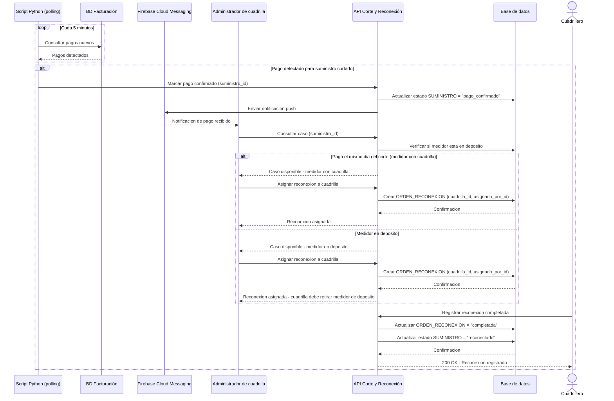

# Diagrama de secuencia — Reconexión de suministro

Basado en docs/prd/PRD.md (Historia 4, 5) y ADR-0001.

## Diagrama

## Auditoría del diagrama

- **¿Cada mensaje representa una interacción real?** Sí — el polling, la
  notificación FCM y la asignación por el administrador están todos
  confirmados en el PRD y el ADR-0001.
- **¿El orden respeta la lógica?** Sí: deteccion → notificación →
  verificación de ubicación del medidor → asignación → reinstalación.
- **¿Hay autorización antes de consultar?** [PREGUNTA ABIERTA] No se
  incluyó explícitamente una validación de sesión para el administrador
  en este diagrama — se asume similar a la del diagrama de corte, pero
  no fue confirmado punto por punto. Se recomienda unificar este criterio.
- **¿Se muestra un flujo alternativo?** Sí — el caso rico de "mismo día
  (medidor con cuadrilla)" vs. "medidor en depósito", que refleja la
  regla de negocio central de la Sección 4 del PRD.
- **¿No se expone información sensible?** No se incluyen datos
  personales del cliente ni de pago más allá de la confirmación de estado.
- **No se inventaron servicios externos no confirmados**: Firebase
  Cloud Messaging y el script Python de polling están confirmados en
  ADR-0001; no se agregó ningún otro sistema.

## Preguntas abiertas

1. ¿Debe agregarse explícitamente la validación de sesión/autorización
   del administrador de cuadrilla en este flujo (como sí se hizo en el
   diagrama de corte)?
2. Este diagrama no representa el caso de fallo de notificación push
   (ver ADR-0001, riesgo aceptado de "sin mecanismo automatizado de
   respaldo") — se podría agregar como un tercer flujo alternativo si
   se considera necesario para el portafolio.
3. ¿"Consultar caso" y "verificar si medidor está en depósito" son
   pasos separados en la implementación real, o una sola consulta
   combinada? Simplificado en este diagrama por claridad conceptual.